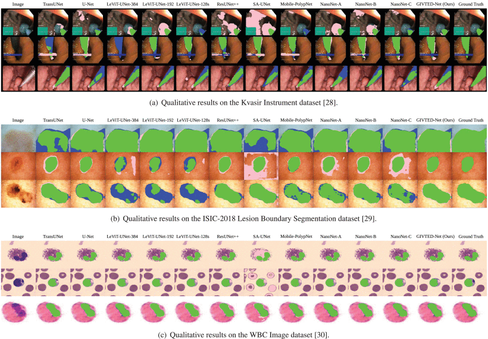

# GIVTED-Net

<div align="center">


The architecture of GIVTED-Net.
</div>

This is the official repository for "[GIVTED-Net: GhostNet-Mobile Involution ViT Encoder-Decoder Network for Lightweight Medical Image Segmentation](https://ieeexplore.ieee.org/document/10552270).". Here, we introduce MIViT (Mobile Involution Vision Transformer) modules powered by newly formed transformer blocks, InvoFormer. The blocks follow the design principle of MetaFormer with an involution-based token mixer and a squeeze-and-excitation module-based channel MLP. These components, along with the Ghost bottlenecks of GhostNet, are compiled in the proposed medical image segmentation model, GIVTED-Net. The model is lightweight (0.19M of parameters and 0.56GFLOPs), fast (2.47 FPS on the Raspberry Pi 4), and quantitatively superior to prior models.


## Requirements

This implementation requires some libraries and frameworks. They can easily be installed by:

```
pip install -r requirements.txt
```


## Dataset

We use the ``KvasirInstrument``, ``ISIC2018``, and ``WBCImage`` datasets to assess the performance of the model. We arrange the datasets in the following:

```
.
└── experiment/
    ├── KvasirInstrument/
    │   ├── TrainDataset/
    │   │   ├── images/
    │   │   │   ├── image_00.jpg
    │   │   │   └── ...
    │   │   └── masks/
    │   │       ├── image_00.jpg
    │   │       └── ...
    │   ├── TestDataset/
    │   │   ├── images/
    │   │   │   ├── image_00.jpg
    │   │   │   └── ...
    │   │   └── masks/
    │   │       ├── image_00.jpg
    │   │       └── ...
    │   ├── result/
    │   │   ├── image_00.jpg
    │   │   └── ...
    │   └── model_pth/
    │       └── GIVTEDNet.pth
    ├── ISIC2018/
    │   ├── TrainDataset/
    │   │   ├── images/
    │   │   │   ├── image_00.jpg
    │   │   │   └── ...
    │   │   └── masks/
    │   │       ├── image_00.jpg
    │   │       └── ...
    │   ├── TestDataset/
    │   │   ├── images/
    │   │   │   ├── image_00.jpg
    │   │   │   └── ...
    │   │   └── masks/
    │   │       ├── image_00.jpg
    │   │       └── ...
    │   ├── result/
    │   │   ├── image_00.jpg
    │   │   └── ...
    │   └── model_pth/
    │       └── GIVTEDNet.pth
    └── WBCImage/
        ├── TrainDataset/
        │   ├── images/
        │   │   ├── image_00.jpg
        │   │   └── ...
        │   └── masks/
        │       ├── image_00.jpg
        │       └── ...
        ├── TestDataset/
        │   ├── images/
        │   │   ├── image_00.jpg
        │   │   └── ...
        │   └── masks/
        │       ├── image_00.jpg
        │       └── ...
        ├── result/
        │   ├── image_00.jpg
        │   └── ...
        └── model_pth/
            └── GIVTEDNet.pth
```


## Training

To train our model:

```
# Please choose either one: KvasirInstrument, ISIC2018, WBCImage
python train.py --dataset_name "KvasirInstrument" 
```

## Testing

We conducted the evaluation on the Raspberry Pi 4. However, it can be run on some other hardware.

```
python eval.py
```


## Benchmark

### Segmentation Performance



*The qualitative results of GIVTED-Net and other models.*


For quantitative results, please check our paper.


### Computational Performance

| Model  | Parameters  | FLOPs  | FPS  |
|---|---|---|---|
| TransUNet  | 105.28M  | 50.70G  |  0.22 |
| U-Net  | 31.04M  |  83.86G |  0.14 |
| LeViT-UNet-384  |  52.15M | 50.82G  |  0.26 |
| LeViT-UNet-192  |  19.89M |  38.58G |  0.36 |
| LeViT-UNet-128s  |  15.89M | 34.86G  | 0.39  |
| ResUNet++  | 4.06M  | 24.28G  | 0.31  |
| SA-UNet  | 0.54M  | 4.86G  |  1.48 |
|  Mobile-PolypNet | 0.23M  |  2.24G | 0.76  |
| NanoNet-A  | 0.29M  | 2.44G  | 1.66  |
|  NanoNet-B | 0.18M  | 1.97G  | 1.71  |
| NanoNet-C  | 43.34K  | 0.44G  |  3.67 |
| **GIVTED-Net (Ours)**  | **0.19M**  | **0.56G**  |  **2.47** |


## Citation

```
@ARTICLE{10552270,
  author={Dwika Hefni Al-Fahsi, Resha and Naghim Fauzaini Prawirosoenoto, Ahmad and Adi Nugroho, Hanung and Ardiyanto, Igi},
  journal={IEEE Access}, 
  title={GIVTED-Net: GhostNet-Mobile Involution ViT Encoder-Decoder Network for Lightweight Medical Image Segmentation}, 
  year={2024},
  volume={12},
  number={},
  pages={81281-81292},
  keywords={Image segmentation;Biomedical imaging;Transformers;Convolutional neural networks;Computational modeling;Decoding;Convolutional neural networks;Deep learning;Deep learning;GhostNet;lightweight model;medical image segmentation;mobile involution ViT},
  doi={10.1109/ACCESS.2024.3411870}
}
```

## Reference

* [KvasirInstrument](https://datasets.simula.no/kvasir-instrument/)
* [ISIC2018](https://challenge.isic-archive.com/data/#2018)
* [WBCImage](https://github.com/zxaoyou/segmentation_WBC)


